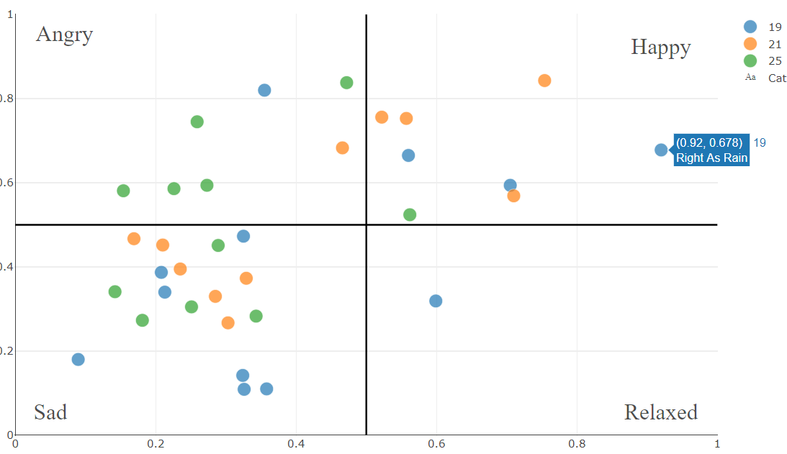
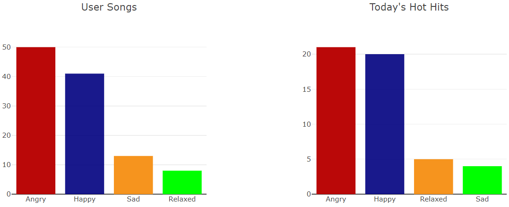
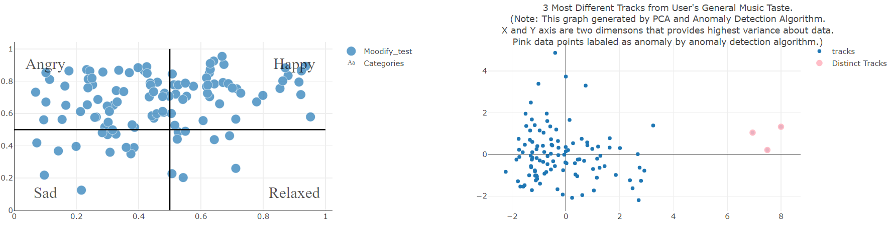

# Musicent musical sentiment analysis application.
## Application is online in [here](https://musicent-63176680ee07.herokuapp.com/)
### App consists of two section:
* __Musical sentiment analysis for user given spotify artist.__ 
&nbsp;&nbsp;&nbsp;&nbsp;&nbsp;Plots a scatter plot of given artist's tracks as shown below. 
&nbsp;&nbsp;&nbsp;&nbsp;&nbsp;X axis represents valence value of tracks 
&nbsp;&nbsp;&nbsp;&nbsp;&nbsp;Y axis represents energy value of tracks 
&nbsp;&nbsp;&nbsp;&nbsp;&nbsp;Data points in scatter plot colored by belonging album. 
  
* __Musical sentiment analysis for user's spotify playlists.__ 
&nbsp;&nbsp;&nbsp;&nbsp;&nbsp;Plots two bar plots. First one is for user's playlist tracks, Second one is for "Today's Hot Hits" playlist tracks   
&nbsp;&nbsp;&nbsp;&nbsp;&nbsp;X axis of bar plots represents mood of tracks. 
&nbsp;&nbsp;&nbsp;&nbsp;&nbsp;Y axis is represenets value counts of corresponding moods.  
  
&nbsp;&nbsp;&nbsp;&nbsp;&nbsp;And plots two scatter plots. 
&nbsp;&nbsp;&nbsp;&nbsp;&nbsp;First one is scatter plot of user's tracks. 
&nbsp;&nbsp;&nbsp;&nbsp;&nbsp; X axis is valence. Y axis is energy. 
&nbsp;&nbsp;&nbsp;&nbsp;&nbsp; Explanation for second scatter plot is given in below screenshot (bottom right). 
&nbsp;&nbsp;&nbsp;&nbsp;&nbsp; X and Y axis of this plot are determined by PCA algorithm. 
&nbsp;&nbsp;&nbsp;&nbsp;&nbsp; Top three distinct tracks are determined by Isolation Forest outlier detection algorithm.   

